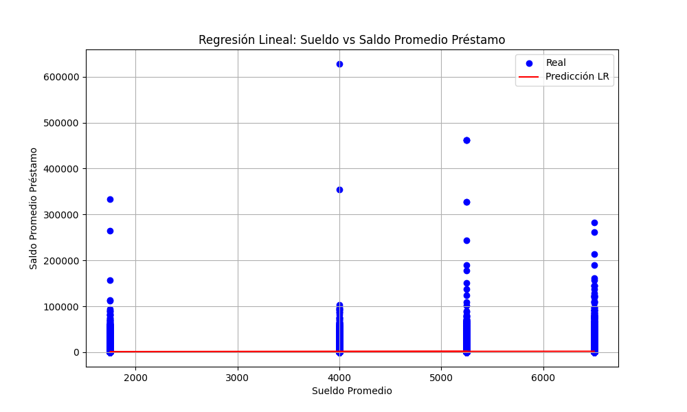
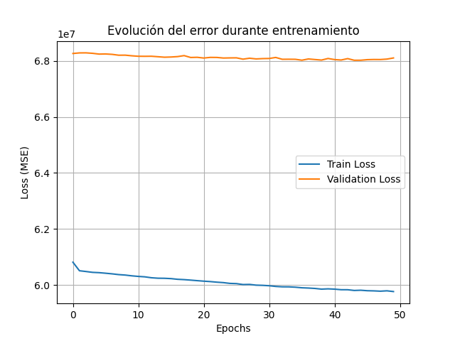
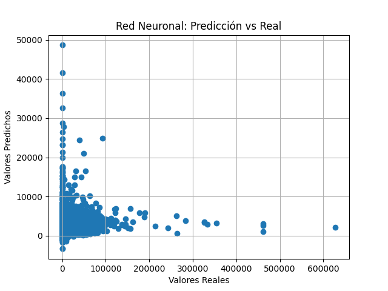

# 📊 Proyecto: Predicción del Monto de Préstamos Digitales

## 🎯 Objetivo del trabajo

El objetivo principal de este proyecto es **predecir el monto promedio de préstamos digitales** que reciben clientes peruanos utilizando técnicas de **regresión lineal simple** y **redes neuronales artificiales (ANN)**. 

Se busca analizar cómo ciertas características demográficas y transaccionales, como el sueldo, edad, frecuencia de transacciones y otros, influyen en el monto del préstamo.

---

## 📁 Breve descripción del dataset

El dataset utilizado contiene información sobre clientes bancarios con registros históricos de transacciones, características demográficas y datos financieros. Las columnas principales incluyen:

- `rango_edad`: Rango de edad del cliente.
- `genero`: Género del cliente.
- `rango_sueldo`: Rango salarial del cliente.
- `prom_saldo_prest_3m`: Promedio del saldo de préstamos en los últimos 3 meses (**variable objetivo**).
- `transacciones_mes`, `canal_digital`, entre otras variables relevantes.

Fuente del dataset: [Kaggle - Préstamos Digitales Perú] *(Puedes poner el link si lo tienes)*

---

## 🧰 Librerías utilizadas

- `pandas`: Para manipulación de datos.
- `numpy`: Para operaciones numéricas.
- `matplotlib`: Para visualización de gráficos.
- `scikit-learn`: Para modelos de regresión y preprocesamiento.
- `tensorflow.keras`: Para construcción y entrenamiento de redes neuronales.
- `seaborn`: Opcional, para gráficos más estilizados.

---

## 🤖 Modelos implementados

### 1. Regresión Lineal Simple

Se usó el **sueldo promedio del cliente** (`sueldo_promedio`) como única variable independiente para predecir el monto del préstamo (`prom_saldo_prest_3m`). El modelo mostró una tendencia general, pero no logró capturar toda la variabilidad debido a su simplicidad.

#### Gráfico:

---

### 2. Red Neuronal Artificial (ANN)

Se entrenó una red neuronal con varias capas densas para predecir el monto del préstamo usando múltiples variables predictoras, incluyendo datos demográficos y transaccionales.

- Arquitectura:  
  - Capa entrada: tamaño según número de características.  
  - Capas ocultas: `Dense(64, relu)`, `Dense(32, relu)`  
  - Capa salida: `Dense(1)`

- Optimizador: `adam`
- Función de pérdida: `mse`
- Métrica: `mae`

#### Gráficos:
- **Evolución del error durante entrenamiento:**  
  
- **Valores predichos vs reales:**  
  

---

## 📊 Conclusiones personales

Este proyecto me permitió aplicar técnicas de machine learning de forma práctica. Algunas conclusiones clave son:

- La **regresión lineal simple** es útil para identificar tendencias iniciales, pero carece de capacidad predictiva cuando hay múltiples factores involucrados.
- La **red neuronal artificial** mejoró las predicciones, aunque aún puede haber margen de mejora al ajustar hiperparámetros o aumentar la cantidad de datos.
- Trabajar con datos reales presentó desafíos comunes como **valores faltantes**, **variables categóricas** y **formatos inconsistentes**, que se resolvieron mediante técnicas de limpieza y preprocesamiento.
- Este tipo de análisis tiene aplicación directa en el sector financiero para evaluar riesgos crediticios y personalizar ofertas de productos.

---

## 📁 Estructura del proyecto

prediccion-prestamos/
├── data/
│ └── dataBasePrestDigital.csv
├── images/
├── app.py
├── README.md
└── requirements.txt

---

## 🚀 Ejecución

1. Clona el repositorio:

   git clone https://github.com/tu-usuario/prediccion-prestamos.git 

2. Instala las dependencias:

    pip install -r requirements.txt

3. Coloca el dataset en la carpeta data/.

4. Ejecuta el script:

    python app.py

5. Los gráficos generados se guardarán automáticamente en la carpeta images/.

---

## ✅ Requisitos técnicos

Archivo requirements.txt:
    pandas
    numpy
    matplotlib
    tensorflow
    scikit-learn
    openpyxl

---

### 📌 ¿Cómo usarlo?

1. Crea un repositorio en GitHub con el nombre que quieras.
2. Guarda este contenido como `README.md` en tu repositorio.
3. Añade los demás archivos (`app.py`, `data/`, imágenes generadas, etc.).
4. ¡Listo! Tendrás un repositorio profesional y bien documentado.

